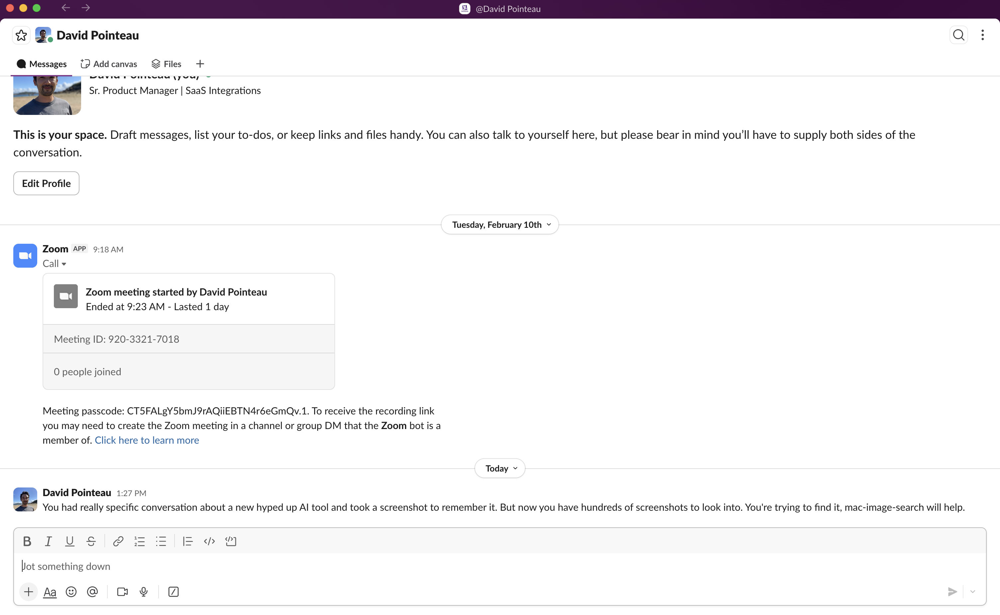

<p align="center">
  <h1 align="center">mac-image-search</h1>
  <p align="center">
    Search your images and screenshots by what's <strong>in</strong> them, not what they're named.
    <br />
    <em>A single Swift script. Zero dependencies. Runs on any Mac.</em>
  </p>
</p>

<p align="center">
  
  
  
  
  
</p>

---

### The problem

You took a screenshot of something important. Now you need it. But your screenshots folder looks like this:

```
Screenshot 2025-06-13 at 9.17.27 AM.png
Screenshot 2025-10-31 at 10.04.32 AM.png
Screenshot 2025-11-20 at 9.43.44 AM.png
... × 500 more
```

macOS Spotlight doesn't OCR screenshot content. You're stuck scrolling through thumbnails.

### The solution

Search by what you **see** in the image:

<p align="center">
  
</p>

```
$ swift image_search.swift "hyped up AI tool"

Search terms: hyped up AI tool
Directory: ~/Desktop/Screenshots
Total images: 556
Cached: 556, Need OCR: 0
---
MATCH: ~/Desktop/Screenshots/Screenshot 2026-03-03 at 1.27.42 PM.png
  Matched terms: hyped up AI tool
  Text: You had really specific conversation about a new hyped up AI tool
  and took a screenshot to remember it. But now you have hundreds of
  screenshots to look into. You're trying to find it, mac-image-search
  will help.
---
Scanned: 556 images
Matches: 1
```

Found in **< 1 second** (cached). That's it.

---

## Quick Start

```bash
git clone https://github.com/dpoint01/mac-image-search.git
cd mac-image-search
swift image_search.swift "your search term"
```

No `brew install`. No `pip install`. No `npm install`. Just `swift` — which is already on your Mac.

## How It Works

```
┌─────────────┐     ┌──────────────────┐     ┌────────────────┐
│  Scan dir   │────▶│  Parallel OCR    │────▶│  Cache to JSON │
│  for images │     │  (all CPU cores) │     │  (auto-expire) │
└─────────────┘     └──────────────────┘     └────────────────┘
                                                      │
                                                      ▼
                    ┌──────────────────┐     ┌────────────────┐
                    │  Results folder  │◀────│  Text search   │
                    │  (symlinks)      │     │  (< 1 second)  │
                    └──────────────────┘     └────────────────┘
```

1. **Scan** — Collects all image files (PNG, JPG, JPEG, HEIC, TIFF, BMP, GIF, WEBP) from the target directory + one level of subdirectories
2. **OCR** — Runs macOS Vision text recognition in parallel across all CPU cores
3. **Cache** — Saves recognized text to a JSON file. Only new/modified files get re-OCR'd
4. **Search** — Case-insensitive text matching against the cached OCR results
5. **Results** — Creates a folder with symlinks to matching files for easy browsing in Finder

### Performance

| | First Run | Subsequent Runs |
|---|---|---|
| **~500 images** | ~2 min (parallel OCR) | **< 1 second** (cache) |
| **CPU usage** | All cores (parallel GCD) | Negligible |
| **Cache** | Auto-invalidates when files change | |

## Zero Dependencies

The script uses **only frameworks built into macOS**. Nothing to install, nothing to audit, nothing to break.

| Framework | Purpose | Ships with |
|-----------|---------|------------|
| `Vision` | Text recognition (OCR) | macOS 10.15+ |
| `AppKit` | Image loading | macOS 10.0+ |
| `Foundation` | File system, JSON, GCD concurrency | macOS 10.0+ |

**Requirements:**
- macOS 13+ (Ventura or later)
- Swift (pre-installed with Xcode or Command Line Tools: `xcode-select --install`)

## Options

```
swift image_search.swift [OPTIONS] <term1> [term2] ...
```

| Flag | Description | Default |
|------|-------------|---------|
| `--dir <path>` | Directory to scan | `~/Desktop/Screenshots` |
| `--cache <path>` | Cache file location | `.ocr_cache.json` in search dir |
| `--match-all` | Require ALL terms to match | Match ANY term |
| `--open` | Open results folder in Finder | Off |
| `--rebuild` | Force re-OCR all images | Off |
| `--fast` | Fast OCR mode (~3x faster, less accurate) | Off |
| `--no-cache` | Disable caching | Off |
| `--no-results-dir` | Don't create results folder | Off |
| `--help` | Show help | |

## Examples

```bash
# Find screenshots containing an error message
swift image_search.swift "connection refused"

# Find receipts or invoices in Downloads
swift image_search.swift --dir ~/Downloads "receipt" "invoice"

# Find screenshots with both a name AND a project
swift image_search.swift --match-all "Alice" "Project Alpha"

# Fast initial scan of a large folder
swift image_search.swift --fast --dir ~/Pictures "vacation"

# Re-index everything (useful if you edited images)
swift image_search.swift --rebuild "quarterly report"

# Search without leaving files behind
swift image_search.swift --no-results-dir --no-cache "password reset"
```

## Supported Formats

PNG, JPG, JPEG, HEIC, TIFF, BMP, GIF, WEBP

## Cache

The OCR cache (`.ocr_cache.json`) maps each file to its recognized text and last-modified timestamp.

- **Auto-invalidation** — modified files get re-OCR'd on next run
- **Force rebuild** — `--rebuild` to re-OCR everything
- **Disable** — `--no-cache` for one-off searches
- **Safe to delete** — it rebuilds automatically

## Use with Claude Code

This repo includes a ready-to-use [Claude Code](https://docs.anthropic.com/en/docs/claude-code) skill:

```bash
mkdir -p ~/.claude/skills/image-search/scripts
cp image_search.swift ~/.claude/skills/image-search/scripts/
cp claude-code/SKILL.md ~/.claude/skills/image-search/
```

Then just say *"search my screenshots for meeting notes"* or invoke `/image-search meeting notes`.

To auto-approve, add to `~/.claude/settings.local.json`:
```json
"Bash(swift ~/.claude/skills/image-search/scripts/image_search.swift:*)"
```

## Security & Privacy

- **100% local.** No data leaves your machine. No cloud APIs. No network calls.
- **Read-only.** Never modifies, moves, or deletes your images. Only writes the cache file and symlinks.
- **Zero dependencies.** Nothing to install. Nothing to audit except one Swift file.
- **Cache contains OCR text.** Add `.ocr_cache.json` to `.gitignore` if your images contain sensitive content.

## License

MIT
